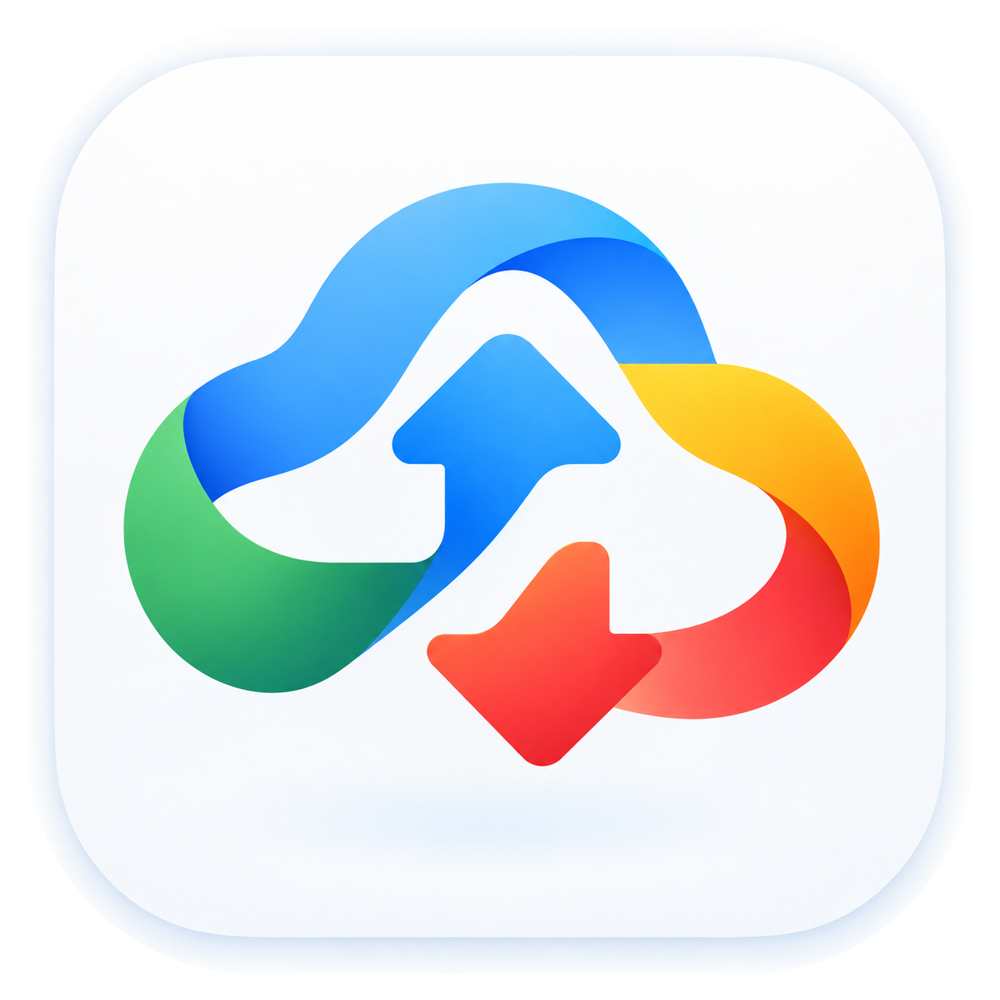
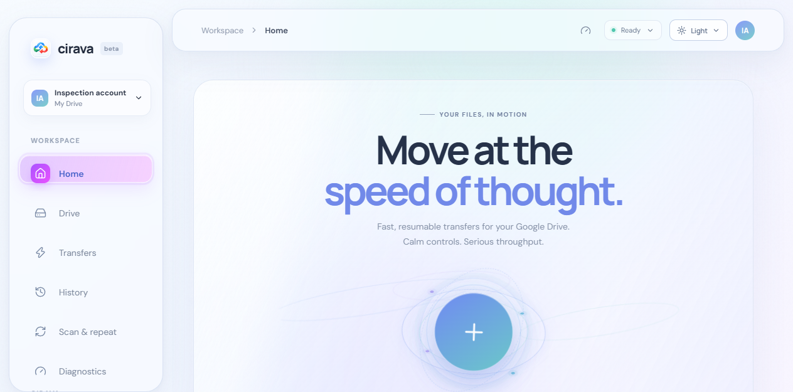

<div align="center">
  
  <h1>Cirava</h1>
  <p><strong>Your files, in motion.</strong><br>
  A calmer, more resilient way to move files through Google Drive.</p>
  <p>
    <a href="https://github.com/B1progame/Cirava/releases/latest"></a>
    
    <a href="https://github.com/B1progame/Cirava/releases/latest"></a>
  </p>
</div>

<br>

<div align="center">
  
</div>

## Move files. Keep your momentum.

Cirava is a focused Windows desktop client for Google Drive. Uploads and downloads are designed to recover from interruptions, while live aggregate progress, throughput, pause, resume, and cancel controls make it easy to see what is happening and stay in control. The app can continue transfers from the system tray while its window is closed.

Open **Drive → Trash** to restore items, permanently empty the trash, and see Google-reported account storage usage. The update dialog lets you choose Stable or Beta from a menu that opens only when requested.

| Keep moving | Stay in control | Keep credentials local |
|:--|:--|:--|
| Resumable transfers pick up after a connection drops. | Follow progress, throughput, retries, and transfer status in one place. | Sign in with Google’s desktop OAuth flow; tokens are protected on your device with Windows DPAPI. |

## Get Cirava

**[Download Cirava v1.1.3 for Windows](https://github.com/B1progame/Cirava/releases/latest)** from GitHub Releases. Choose `Cirava-Setup-1.1.3.exe` for the guided installer or `Cirava.exe` for the standalone app. The release also includes `update-manifest.json` for checksum-verified in-app updates.

Cirava connects with a Google **Desktop OAuth client**. Follow the [Google setup guide](GOOGLE_SETUP.md) to configure the client ID and Drive API access. Cirava never asks for your Google password.

New to Cirava? The [Cirava wiki](https://github.com/B1progame/Cirava/wiki) walks through setup, uploads, downloads, transfer controls, and common fixes.

## Build it yourself

For development, use Windows 10 or 11, Node.js, and Python 3.12. PyInstaller and Inno Setup 6 are needed to package the desktop installer.

```powershell
npm.cmd install
npm.cmd run dev -- --host 127.0.0.1 --port 4175
```

To build and check the desktop app:

```powershell
npx.cmd tsc --noEmit
npm.cmd run build
$env:PYTHONPATH = 'backend'
python -m unittest discover -s backend/tests -q
npm.cmd run package:desktop
npm.cmd run package:installer
```

More detail: [testing](TESTING.md) · [architecture](ARCHITECTURE.md) · [packaging](packaging/README.md).

## Security and scope

- Google sign-in uses authorization code + PKCE and requests full Drive access so the app can show the complete Trash, restore items, empty Trash, and report account storage usage. Existing sessions must reconnect to approve this permission.
- Google classifies the full `drive` scope as restricted; the OAuth consent configuration and applicable Google verification requirements must be satisfied before distributing this mode publicly.
- OAuth tokens are protected with Windows DPAPI.
- Transfers respect Google Drive permissions, quotas, and rate limits.
- Updates use HTTPS and verify the downloaded app against its published SHA-256 before applying it.

See the [security model](SECURITY.md) and [performance notes](PERFORMANCE.md).

Cirava is an independent project and is not affiliated with, endorsed by, or sponsored by Google LLC. No redistribution license has been selected yet.
