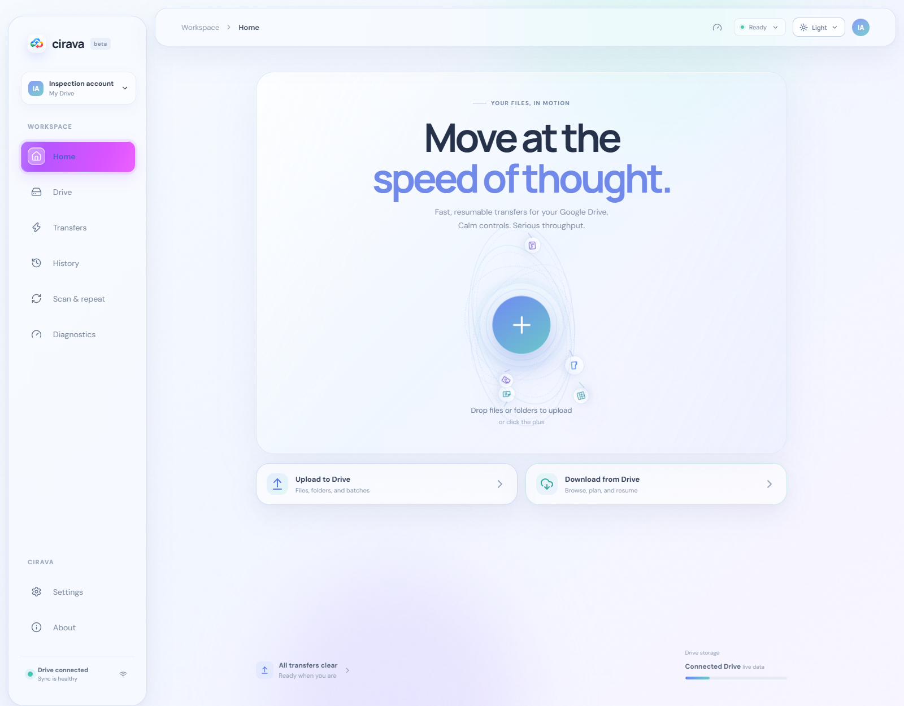

<div align="center">
  
  <h1>Cirava</h1>
  <p><strong>Your files, in motion.</strong><br>
  A calmer, more resilient way to move files through Google Drive.</p>
  <p>
    <a href="https://github.com/B1progame/Cirava/releases/latest"></a>
    
    <a href="https://github.com/B1progame/Cirava/releases/latest"></a>
  </p>
</div>

<br>

<div align="center">
  
  <p><sub>Home · light appearance · animated upload orb</sub></p>
</div>

## Move files. Keep your momentum.

Cirava is a focused Windows desktop client for Google Drive. Uploads and downloads are designed to recover from interruptions, while live progress makes it easy to see what is happening and what needs attention.

| Keep moving | Stay in control | Keep credentials local |
|:--|:--|:--|
| Resumable transfers pick up after a connection drops. | Follow progress, throughput, retries, and transfer status in one place. | Sign in with Google’s desktop OAuth flow; tokens are protected on your device with Windows DPAPI. |

## Home, in motion

The Home screen keeps the two everyday actions close: send files to Drive or bring them back. The orbit gives the workspace a little motion while keeping the upload action at its center.

<div align="center">
  
  <p><sub>A full-page view of Home. Both screenshots show the Home page only.</sub></p>
</div>

## Get Cirava

**[Download Cirava v1.0.0 for Windows](https://github.com/B1progame/Cirava/releases/latest)** from GitHub Releases. The installer is `Cirava-Setup-1.0.0.exe`.

Cirava connects with a Google **Desktop OAuth client**. Follow the [Google setup guide](GOOGLE_SETUP.md) to configure the client ID and Drive API access. Cirava never asks for your Google password.

## Build it yourself

For development, use Windows 10 or 11, Node.js, and Python 3.12. PyInstaller and Inno Setup 6 are needed to package the desktop installer.

```powershell
npm.cmd install
npm.cmd run dev -- --host 127.0.0.1 --port 4175
```

To build and check the desktop app:

```powershell
npx.cmd tsc --noEmit
npm.cmd run build
$env:PYTHONPATH = 'backend'
python -m unittest discover -s backend/tests -q
npm.cmd run package:desktop
npm.cmd run package:installer
```

More detail: [testing](TESTING.md) · [architecture](ARCHITECTURE.md) · [packaging](packaging/README.md) · [release checklist](RELEASING.md).

## Security and scope

- Google sign-in uses authorization code + PKCE and the `drive.file` scope.
- OAuth tokens are protected with Windows DPAPI.
- Transfers respect Google Drive permissions, quotas, and rate limits.
- Updates use HTTPS and verify the installer SHA-256 before installation.

See the [security model](SECURITY.md) and [performance notes](PERFORMANCE.md).

Cirava is an independent project and is not affiliated with, endorsed by, or sponsored by Google LLC. No redistribution license has been selected yet.
